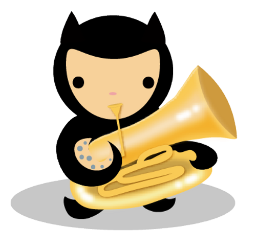

### Hoopla!

👋🏼 I'm andytuba ([they/them or he/him](https://pronoun.is/they?or=he)). 

🔭 I work at Reddit as Engineering Manager for the Consumer Safety team.

📫 Catch me on [andytuba.com](https://andytuba.com).

Headshot © 2021 [A Strong Photo](https://astrongphoto.com)

<!--
**andytuba/andytuba** is a ✨ _special_ ✨ repository because its `README.md` (this file) appears on your GitHub profile.

Here are some ideas to get you started:

- 🔭 I’m currently working on ...
- 🌱 I’m currently learning ...
- 👯 I’m looking to collaborate on ...
- 🤔 I’m looking for help with ...
- 💬 Ask me about ...
- 📫 How to reach me: ...
- 😄 Pronouns: ...
- ⚡ Fun fact: ...
-->
